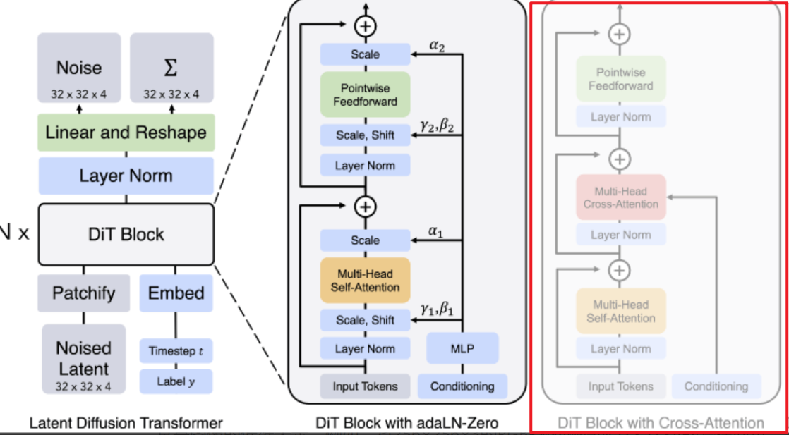

# Stable-V2A

## TODO
- [DONE] Add function: generate audio from video without pre-extracted CLIP features.
- Add parameter: Duration. Clamp the generated audio wav beyond the duration limit.
- Analyse: Why other model can't adapt to variable length video?
- Evaluation: On both 10-sec and variable-length dataset.

## Weakness
- 杂音，好像很少生成安静的声音
- 有很多周期性的 敲击/说话/音乐的声音
- 视频开头的画面对整个音频生成的影响非常大
- time align做的不好

## Tricks
- cleaning data? 去除杂音、speech等等? -----暂时先不用做
- Try different DiT models.
- Try different sample steps.